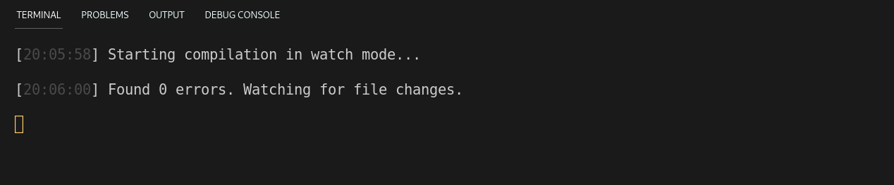

# Starting to code.

I will use typescript in this project so I can easily implement the library in both client-side and server-side. Let’s start talking about the structure.


This is in fact very simple. I use **src** as my source code directory so the Typescript can get it from there, **out** as my Javascript output, **markdown** to test some random files and **test** to make some test code there.

### Nodejs and Typescript

To compile typescript in real time **I install nodejs and typescript** inside of it. Then I create **two npm scripts** to compile: 

```json
"scripts": {
    "compile": "tsc",
    "compile-watch": "tsc --watch"
}
```

I’ll use **compile-watch for development** and compile for releases. 

## Configure typescript

*Configuring typescript for the first time may be a little bit confusing, in fact one of the biggest issues of typescript is that’s so configurable that can’t be plug and play anymore.* 

To do so, we need a file called tsconfig.json, an standard JSON format file with setting inside, here’s mine: 

```json
{
    "compilerOptions": {
        "target": "es2021",
        "module": "es2015",
        "strictFunctionTypes": true,
        "moduleResolution": "node",
        "outDir": "out/"
    },
    "include": [
        "src/**/*"
, "style/markdown.ts"    ],
    "exclude": [
        "node_modules",
        "**/node_modules/*"
    ]
}
```

I’m a little bit on the risky side here telling Typescript to compile my source code to the most recent version of Javascript, but I’ll need that to use the latest language features and I like pushing the technology to the future, just a little bit. 

## Let’s try compiling a piece of code

We can write a little code snippet just to check if Typescript is doing its stuff just fine. No problem is shown here.



Okay so we are ready to go!

[Go back.](../README.md)
