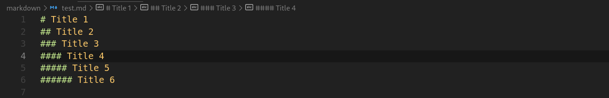
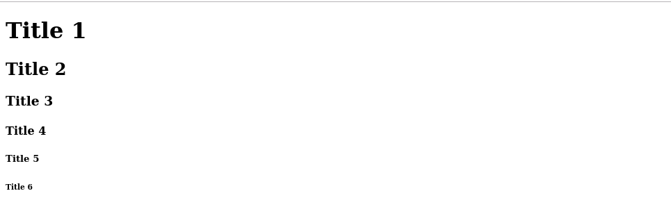

# Problems

The abstractions we made in the last pages were working well, so I develop a little further, even having some Markdown converted to HTML





So, everything is working fine, doesn’t? Not exactly.

## Trouble is showing up! Block vs lines.

The title blocks were simple to get, divide the text into lines (Using the ‘\n’  character)  and match if the text starts with “#” + space. Same logic applies to the secondary title (##) and all the subtitles up to ###### (<H6> in HTML). 

I tested something more in the complex side.

```markdown
```javascript
var foo = "bar";
```
```

But when the output was shown I realize strange behaviour in our AbstractTree.

```json
{
  "children": [
    {
      "text": "```javascript",
      "children": [],
      "type": "unknown"
    },
    {
      "text": "var foo = \"bar\";",
      "children": [],
      "type": "unknown"
    },
    {
      "text": "```",
      "children": [],
      "type": "unknown"
    }
  ]
}
```

## Of course! The multi-line blocks!!!! 😭😭😭

Some of the common markdown blocks start at one line and end on a different one, that makes my code practically useless!

```tsx
let lines = text.split("\n"); 
```

This line of code makes nearly impossible to handle multi line blocks because is handling every single line like a block to tokenize. I’m a little stuck now, I will need to change the Tokenizer approach and may be some coffee.

[Go back.](../README.md)
